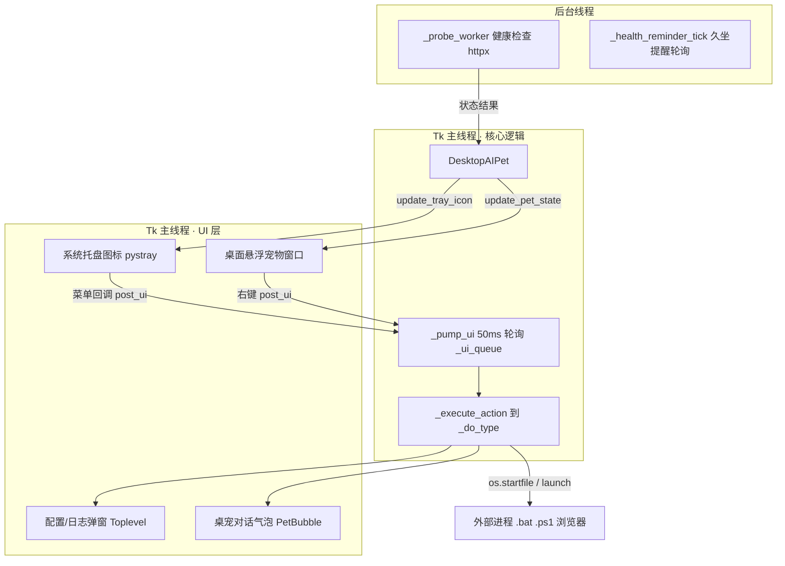

# Desktop AIPet — 桌面 AI 助理 设计说明书

> 版本：v2.0（配置驱动型 · 多工具监控）
> 更新日期：2026-08-08
> 作者：zhixinglvren

---

## 1. 概述

### 1.1 项目定位

Desktop AIPet 是一个轻量级 Windows 桌面 AI 助理。它以**系统托盘图标 + 可拖拽悬浮桌宠**双形态常驻桌面，通过 HTTP 健康探测监控本地 AI 工具的运行状态，并通过右键菜单提供对它们的启停、官网/WebUI 跳转、工作空间跳转、配置与日志查看。

当前内置监控/管理对象（均可在 `config.json` 的 `menus[]` 中增删改）：

- **Nanobot Gateway** —— 带 HTTP 健康探测（`endpoint`）的后端服务。
- **Claude Code / Codex / OpenCode** —— 三类 AI 编程助理，作为纯菜单组（`type=ai_assistant`，无探测，仅有快捷动作）。
- **久坐提醒** —— 定时气泡提醒（`type=health_reminder`）。

**所有菜单行为均由 `config.json` 驱动，不在代码中硬编码。** 修改/新增菜单动作只需编辑配置，无需改动 `aipet.py`（例外情况见 aipet-spec.md 硬约束）。

### 1.2 双形态设计

| 形态 | 技术 | 说明 |
|------|------|------|
| 📌 系统托盘图标 | `pystray` | 通知区域常驻；右键菜单为完整控制入口；鼠标悬停提示显示「桌面AI助理」或「桌面AI助理-昵称」 |
| 🖼️ 桌面悬浮桌宠 | `tkinter` | frameless + 置顶 + 透明背景 + 可拖拽；旁侧附带对话式气泡 `PetBubble` 展示当前活动/操作反馈；与托盘共享同一套状态与右键菜单 |

### 1.3 核心价值

- **状态可见**：托盘/桌宠右键菜单标题与子菜单项的 emoji（🟢/🟡/🔴）一眼知状态，不点开菜单亦可判断服务健康。
- **不碍事**：悬浮宠物可拖拽到角落、可隐藏、可关闭桌面显示（仅留托盘）。
- **配置化**：菜单动作、监控目标、路径、AI 助理、提醒全部走 `config.json`，扩展零代码。
- **离线可靠**：应用内对话式气泡 `PetBubble`（tkinter，依附桌宠）替代传统弹出式 Toast，适配离线金融内网。
- **陪伴感**：桌宠可眨眼、双击庆祝，并随机说一句配置中的台词（含对用户的称呼）。

### 1.4 项目路径

```
E:\Portfolio\desktop-aipet\
```

---

## 2. 技术栈

| 组件 | 选型 | 理由 |
|------|------|------|
| 桌面悬浮窗 | `tkinter`（Python 内置） | 零额外安装；frameless + 透明色 + 置顶 |
| 托盘图标 | `pystray` | 纯 Python，稳定；支持动态重建菜单 |
| 宠物/托盘图标绘制 | `Pillow`（PIL） | 程序化生成 PNG/ICO，支持透明通道与中性机器人形象 |
| HTTP 健康探测 | `httpx`（缺失时回退 `urllib`） | 复用环境已有依赖 |
| 应用内对话气泡 | `tkinter.Toplevel`（`PetBubble`） | 依附桌宠展示当前活动/操作反馈，不依赖系统通知 API，离线环境可靠 |
| 开机启动 | `start.vbs` + Startup 目录 | 标准做法；`pythonw` 无控制台启动 |

---

## 3. 技术架构



**关键约束**：`pystray.Icon.run()` 运行在**托盘线程**，所有 `tkinter` 操作必须经由 `post_ui()` 编组到 Tk 主线程（`_pump_ui` 每 50ms 轮询 `_ui_queue` 执行）。跨线程直接操作 tkinter 会被 `pythonw` 静默吞掉异常，表现为"菜单点击无反应"。详见 aipet-spec.md §3。

---

## 4. 目录结构

```
desktop-aipet/
├── aipet.py              # 主程序入口（全部逻辑，约 2000 行）
├── config.json           # 监控与菜单配置（核心可配置项）
├── aipet-design.md       # 本设计说明书
├── aipet-spec.md         # SDD 硬约束（AI 编码代理必须遵守）
├── README.md             # 用户使用与自定义配置指南
├── start.vbs             # 开机静默启动脚本源
├── pets/
│   └── robot/            # 桌宠形象 PNG（首次启动由 PIL 生成并缓存）
│       ├── normal_0.png / normal_1.png
│       ├── warning_0.png / warning_1.png
│       ├── error_0.png / error_1.png
│       ├── happy_0.png / happy_1.png   # 双击庆祝帧
│       └── blink_0.png                  # 眨眼帧
├── icons/                # 托盘 .ico（启动时由 PIL 生成并落盘）
│   ├── normal.ico
│   ├── warning.ico
│   └── error.ico
├── logs/
│   └── aipet.log         # 运行日志（UTF-8，RotatingFileHandler，2MB 轮转×3）
└── start-gateway.bat / stop-gateway.bat   # Nanobot 启停脚本（位于 %USERPROFILE%\.nanobot\）
```

> 注：旧版文档中的 `pet.py`、`pets/cat|bunny` 等多主题目录已不再使用。当前仅 `robot` 主题，形象由代码程序化生成，无需手工图片资源。

---

## 5. 配置设计（config.json）

### 5.1 顶层结构

```json
{
  "desktop_aipet": { /* 桌宠与全局开关、昵称/称呼 */ },
  "menus": [ /* 菜单组：健康监控 / AI 助理 / 久坐提醒，顺序即菜单显示顺序 */ ],
  "greetings": [ /* 桌宠双击/召唤时随机展示的台词（纯文案，不含称呼） */ ]
}
```

> ⚠️ 早期版本使用 `monitors` 键承载监控项，**现已统一为 `menus`**，`monitors` 不再被读取。

### 5.2 `desktop_aipet` 字段

| 字段 | 默认值 | 说明 |
|------|--------|------|
| `pet_theme` | `"robot"` | 桌宠形象主题。内置：`robot`、`labrador`（拉布拉多）、`bluecat`（蓝猫）、`piggy`（小猪）、`bunny`（小白兔）、`wukong`（孙悟空）、`pony`（小马）。托盘菜单「🔄 切换助理」按此顺序循环切换，并同步更换托盘图标 |
| `pet_visible` | `true` | 是否创建悬浮宠物窗口；`false` 时仅托盘 |
| `pet_scale` | `1.0` | 缩放比例（适配高分屏） |
| `pet_x` / `pet_y` | 运行时保存 | 悬浮宠物退出时的坐标；`null` 时默认右下角 |
| `check_interval_s` | `30` | 健康检测间隔（秒） |
| `log_retention_days` | `7` | 日志保留天数（参考值） |
| `auto_restart_on_failure` | `false` | 失败自启开关（未强制启用） |
| `nickname` | `""`（空） | 助理昵称；非空时托盘悬停/标题/气泡标题显示「桌面AI助理-昵称」 |
| `boss` | `"老板"` | 助理对用户的称呼；随机台词前统一拼接「{boss}，」前缀 |

### 5.3 `menus[]` —— 三种菜单组类型

`menus[]` 中每一项是一个**菜单组**，按数组顺序显示。根据是否带 `endpoint` / `type` 分为三类：

| 类型 | 判定字段 | 是否探活 | 菜单前缀 | 说明 |
|------|----------|----------|----------|------|
| 健康监控 | 含 `endpoint` | ✅ 是 | 🟢/🔴 状态圆圈 | 后端服务健康探测 |
| AI 助理 | `type="ai_assistant"` | ❌ 否 | `icon` 图标（如 🌟） | 纯快捷动作组，不探活、不显示圆圈 |
| 久坐提醒 | `type="health_reminder"` | ❌ 否 | `icon` 图标（如 ❤️） | 定时气泡提醒；子项为开启/关闭/测试 |

**公共字段（所有菜单组）：**

| 字段 | 说明 |
|------|------|
| `name` | 菜单组名称，作为级联标题 |
| `enabled` | 是否启用（默认 `true`）。`false` 时**右键菜单中完全不展示该菜单项**，也不参与健康检测。便于非技术用户把不需要的技术类菜单（如 AI 助理）整体关闭，只保留想要的（如久坐提醒） |
| `icon` | 图标 emoji，作为无 `endpoint` 组的菜单前缀（健康监控组忽略此项，用状态圆圈） |
| `actions[]` | 该组下的右键菜单动作；**数组顺序即菜单显示顺序** |

**健康监控组专属字段：** `endpoint`（HTTP GET 探测 URL）、`config_path`、`log_path`、`workspace_key`（工作空间在配置中的 dotted 路径）。

**久坐提醒组专属字段：** `start_hour`/`end_hour`（生效时段，24h）、`interval_minutes`（提醒间隔分钟）、`skip_hours`（跳过的整点小时数组）、`message`（提醒文案）、`reminder_enabled`（提醒开关，默认 `true`；与 `enabled` 独立：`enabled` 控制菜单是否展示，`reminder_enabled` 控制提醒是否真正触发，由组内「开启/关闭提醒」切换）。

所有路径支持 `%USERPROFILE%`、`~` 展开（经 `expand()`），不写死绝对路径。

### 5.4 动作类型总表

每个动作是 JSON 对象，必须显式声明 `type`。解析链：`_action_type()` → `_execute_action()` → `_do_<type>()`。每个动作可带 `label`（菜单文字）与 `icon`（前置图标 emoji）。

| `type` | 用途 | 关键字段 |
|--------|------|----------|
| `url` | 打开浏览器/地址 | `url` |
| `file` | 用默认程序打开文件 | `path` / `file` |
| `cmd` | 执行 cmd 命令 | `command`/`cmd`、`window`(`visible`/`hidden`)、`keep_open` |
| `powershell` | 执行 PowerShell 命令 | `command`、`window`、`keep_open` |
| `script` | 执行 `.bat`/`.ps1` 脚本 | `path`、`window`、`tee_log`、`log_path`、`append_log`、`keep_open` |
| `script_seq` | 顺序执行多步（如 停止→启动） | `steps[]`、`delay_s`（步间延迟秒） |
| `open_workspace` | 打开文件夹（直接给 `path`，或读取配置 workspace 字段） | `path` 或 `config_path`+`config_key`（或 monitor 级 `workspace_key`） |
| `popup_file` | 只读文件查看器（JSON 自动格式化） | `path`、`title`、`pretty_json` |
| `popup_log` | 实时尾随日志窗口 | `path`/`log_path`、`refresh_ms`、`tail_lines`、`title`、`hint` |
| `reminder_enable` | 开启久坐提醒（仅 `health_reminder` 组内） | `label`、`icon` |
| `reminder_disable` | 关闭久坐提醒（仅 `health_reminder` 组内） | `label`、`icon` |
| `reminder_test` | 立即测试弹出提醒（仅 `health_reminder` 组内） | `label`、`icon` |

新增类型只需实现 `_do_<type>` 方法，分发逻辑（`getattr`）无需改动。

### 5.5 当前实际菜单（顶部状态项之后，按 `menus[]` 顺序）

1. **❤️ 久坐提醒**（`type=health_reminder`，`enabled=true` 展示菜单，`reminder_enabled=true` 实际触发提醒）
   - 🔛 开启提醒（开启后标签带 `[✓]`，切换 `reminder_enabled`）
   - ⏸ 关闭提醒（关闭后标签带 `[✓]`，切换 `reminder_enabled`）
   - 🔔 测试提醒（立即弹一次）
2. **🟢 Nanobot**（`endpoint` 健康监控）
   - 🌐 启动 Gateway（`script`，tee 日志）
   - 🔄 重启 Gateway（`script_seq`：先 stop 后 start）
   - 🏠 打开官网（`url` → https://nanobot.wiki）
   - 🖥️ 打开 WebUI（`url` → http://127.0.0.1:8765）
   - 📂 跳转工作空间（`open_workspace`）
   - 💬 微信渠道授权（`powershell`，可见窗口）
   - ⚙️ 查看运行配置（`popup_file`）
   - 📄 查看运行日志（`popup_log`）
3. **🌟 Claude Code**（`type=ai_assistant`）
   - 🚀 启动 Claude Code（`powershell` → `claude --permission-mode bypassPermissions`）
   - 🌐 打开官网（`url` → https://claude.com/claude-code）
   - 📁 跳转工作空间（`open_workspace` → `%USERPROFILE%\.claude`）
   - ⚙️ 查看运行配置（`popup_file` → settings.json）
   - 📄 查看 Agent 配置（`popup_file` → CLAUDE.md）
4. **💠 Codex**（`type=ai_assistant`）
   - 🚀 启动 Codex / 🌐 打开官网（https://developers.openai.com/codex）/ 📁 工作空间（`%USERPROFILE%\.codex`）/ ⚙️ 运行配置（config.toml）/ 📄 Agent 配置（AGENTS.md）
5. **🔮 OpenCode**（`type=ai_assistant`）
   - 🚀 启动 OpenCode / 🌐 打开官网（https://opencode.ai）/ 📁 工作空间（`%USERPROFILE%\.config\opencode`）/ ⚙️ 运行配置（opencode.json）/ 📄 Agent 配置（AGENTS.md）

**「📂 更多」二级子菜单：**

- 🔄 健康检测（立即触发一次探测）
- ⚙️ 开机自启（标签带 `[✓]`/`[ ]` 勾选状态）
- 🛠️ 助理配置（只读 `ConfigViewer` 查看 config.json；可切到编辑态修改并保存，保存后热重载）
- 🌀 重载配置（重新读取 config.json 并重建菜单）

**末尾：**

- 🔁 重启（拉起新实例后退出当前）
- ❌ 退出（退出时**不写回** config.json，避免覆盖用户已改好的配置）

---

## 6. 状态系统

| 状态 | 颜色 | 含义 | 圆点 emoji |
|------|------|------|------------|
| `normal` | `#22c55e`（绿） | 所有健康监控项正常 | 🟢 |
| `warning` | `#f59e0b`（黄） | 部分异常（有正常有异常） | 🟡 |
| `error` | `#ef4444`（红） | 全部异常 | 🔴 |

**表达位置：**

- **机器人图标 / 桌宠**：保持**中性配色**（灰蓝身体、青色屏幕、黄色天线），不随状态变色，也不叠加任何状态圆点或徽标。
- **顶层菜单标题**：固定显示 "🟢/🟡/🔴 桌面AI助理（或 -昵称）"，使用**聚合状态**（见下）。
- **各健康监控子菜单标题**：显示 "🟢 MonitorName" 或 "🔴 MonitorName"，**仅二态**（正常=绿，异常=红），不显示 "HTTP 200" 等探测详情。
- **AI 助理 / 久坐提醒组**：不显示状态圆圈，改用各自 `icon` 作为前缀（🌟/💠/🔮/❤️）。

**文字规则**：菜单标题仅写 "桌面AI助理" 或监控名，不写 "全部正常"/"异常"/"HTTP 200" 等摘要文字；鼠标悬停提示（tooltip）显示 "桌面AI助理" 或 "桌面AI助理-昵称"（含昵称时），不带 emoji / 状态摘要。

**聚合规则**：仅统计带 `endpoint` 的启用监控项 → 全正常 `normal`/`🟢`；有正常有异常 `warning`/`🟡`；全异常 `error`/`🔴`。`warning` 只出现在聚合层，单个监控项没有黄色状态。AI 助理与久坐提醒不参与健康聚合。

**更新规则**：状态变化时调用 `update_tray_icon(state, changed=True)` 同时换图标 + `update_menu()`；平时仅更新 `title` 与图标，**不每轮重建菜单**（跨线程频繁操作 HMENU 有风险）。

---

## 7. 线程模型

| 线程 | 职责 | 禁忌 |
|------|------|------|
| 托盘线程（pystray） | 托盘图标事件循环、菜单回调 | 禁止直接 `subprocess.Popen` / `os.startfile` / 建 `Toplevel` |
| Tk 主线程（mainloop） | 全部 GUI、进程启动、动画 | — |
| 后台探测线程 | 定时 HTTP 健康检查 | — |
| 主线程轮询 | `_health_reminder_tick` 经 `root.after` 递归调度 | — |

回调统一封装为 `lambda: self.post_ui(...)`（见 `make_handler()`）。`post_ui()` 将 callable 放入 `_ui_queue`，由 `_pump_ui()` 在 Tk 主线程每 50ms 取出执行，失败经 `try/except` 转 `PetBubble` 气泡 + 写日志。**新增动作类型必须复用此封装。**

---

## 8. 桌面悬浮窗

### 8.1 窗口属性

```python
root.overrideredirect(True)                       # 无标题栏
root.attributes('-topmost', True)                 # 始终置顶
root.attributes('-transparentcolor', '#010101')    # 透明背景色
root.geometry(f'{w}x{h}+{x}+{y}')                 # 定位（退出时保存 pet_x/pet_y）
```

窗体刻意用 `WS_EX_TOOLWINDOW` 隐藏任务栏条目（需在 `-transparentcolor` 之后设置，否则会被覆盖）。

### 8.2 交互

- **拖拽**：桌面宠物上按住拖拽移动，松手后坐标写回 `config.json`（`_save_config`）。
- **单击（左/右键）**：机器人**眨眼**互动（`play_blink`，闭眼约 150ms 后恢复），**不弹任何健康提示**。用 0.3s 去抖避免与双击冲突。
- **双击**：触发**庆祝动画**（`play_double_click_anim`：两次弹跳 + 横向跑动摆动 + happy 弯眼帧），动画期间暂停呼吸/眨眼，结束后复位；并随机在 `PetBubble` 展示一句预设台词（`greetings`，见 §5.1）。
- **右键**：弹出与托盘同源的菜单。

### 8.3 动画

`start_animation()` / `_animate()` 以约 800ms 间隔在两帧间切换（呼吸效果），状态变化时切换对应状态的帧序列。另有 `happy`（双击庆祝）与 `blink`（眨眼）专用帧。

### 8.4 隐藏 / 显示

- **隐藏到托盘**：右键"🙈 隐藏助理" → `root.withdraw()`，托盘图标保留，并保存 `pet_visible=false`。
- **显示 AI 助理**：托盘菜单"✨ 召唤助理" → `root.deiconify()`，并随机展示一句台词；菜单标签随状态在「隐藏/召唤」间切换。
- `pet_visible=false` 时启动不创建悬浮窗，仅托盘。

### 8.5 对话气泡 `PetBubble`

`PetBubble` 是依附于桌宠的轻量级对话式提示框，替代传统右下角弹出 Toast：

- **单实例**：新的通知会更新同一气泡内容并重置自动隐藏计时器，避免堆叠弹窗。
- **位置**：桌宠可见时出现在宠物上方（水平居中），若超出屏幕上边缘则翻转到宠物下方；桌宠隐藏时退化为屏幕右下角气泡。
- **外观**：圆角矩形 + 小三角尾巴，根据 `level` 显示不同主题色：
  - `info`：浅蓝背景 / 蓝色标题
  - `ok`：浅绿背景 / 绿色标题
  - `warn`：浅黄背景 / 黄色标题
  - `error`：浅红背景 / 红色标题
- **行为**：自动隐藏（默认 4s，提醒类 8s），点击气泡立即关闭。
- **入口**：所有 `self.notify(title, message, level)` 调用最终都路由到 `self.bubble.show(...)`，菜单动作执行结果、异常、健康状态变化、随机台词、久坐提醒均通过气泡反馈。

---

## 9. 系统托盘

### 9.1 图标

中性机器人图标（`generate_tray_icons()` 程序化生成并落盘 `icons/*.ico`）。悬浮宠物显示时托盘图标常驻；隐藏时托盘是菜单入口。

### 9.2 托盘右键菜单（完整结构）

```
┌─────────────────────────────────┐
│ 🟢 桌面AI助理-小新               │  (顶层状态项，聚合状态)
├─────────────────────────────────┤
│ ❤️ 久坐提醒                      │
│   ├─ 🔛 开启提醒        [ ]      │
│   ├─ ⏸ 关闭提醒        [✓]      │  (当前生效项带 [✓])
│   └─ 🔔 测试提醒                │
│ 🟢 Nanobot 🟢                    │
│   ├─ 🌐 启动 Gateway             │
│   ├─ 🔄 重启 Gateway             │
│   ├─ 🏠 打开官网                 │
│   ├─ 🖥️ 打开 WebUI              │
│   ├─ 📂 跳转工作空间             │
│   ├─ 💬 微信渠道授权             │
│   ├─ ⚙️ 查看运行配置             │
│   └─ 📄 查看运行日志             │
│ 🌟 Claude Code                   │
│   ├─ 🚀 启动 Claude Code         │
│   ├─ 🌐 打开官网                 │
│   ├─ 📁 跳转工作空间             │
│   ├─ ⚙️ 查看运行配置             │
│   └─ 📄 查看 Agent 配置          │
│ 💠 Codex / 🔮 OpenCode …         │  (结构同上)
├─────────────────────────────────┤
│ 🙈 隐藏助理 / ✨ 召唤助理         │  (随桌宠可见性动态切换)
│ 📂 更多                          │
│   ├─ 🔄 健康检测                 │
│   ├─ ⚙️ 开机自启      [✓]        │
│   ├─ 🛠️ 助理配置                 │
│   └─ 🌀 重载配置                 │
├─────────────────────────────────┤
│ 🔁 重启                          │
│ ❌ 退出                          │
└─────────────────────────────────┘
```

桌宠右键菜单结构同源，差异在于"隐藏/召唤"文案随当前状态切换。

---

## 10. 动作执行引擎

### 10.1 分发链

```
make_handler(action, monitor)
   → post_ui(lambda: _execute_action(action, monitor))
      → atype = _action_type(action)
      → fn = getattr(self, "_do_" + atype)
      → fn(action, monitor)        # 全量 try/except
```

- `_action_type()`：优先取 `type` 字段；兼容旧配置（`url`/`file`/`cmd` 作为键名）；否则 `noop`。
- `_execute_action()`：记录日志、按类型分发、异常转 `PetBubble` 气泡 + 文件日志。
- `_do_<type>()`：具体实现（含 `reminder_enable`/`reminder_disable`/`reminder_test`）。

### 10.2 脚本日志（tee 管道）

`script` / `script_seq` 的 `tee_log=true` 步骤经 `build_tee_powershell()` 生成 PowerShell，用 `System.IO.StreamWriter`（UTF-8 无 BOM + AutoFlush）将脚本输出实时写入 `log_path`，供"查看运行日志"窗口尾随。**禁用 PowerShell `Tee-Object`**（PS 5.1 仅写 UTF-16）。

`script_seq` 在独立后台线程执行多步，步间 `delay_s` 间隔，避免阻塞 UI 线程。

### 10.3 弹窗

- **ConfigViewer**（`popup_file` / 「🛠️ 助理配置」）：只读文本框展示文件内容，JSON 自动美化；单例窗口（同文件只开一个）；支持复制路径、外部打开。从「助理配置」进入时可切编辑态，保存时做 JSON 合法性校验，成功则触发热重载。
- **LogViewer**（`popup_log`）：实时尾随日志文件（`refresh_ms` 定时重读、`tail_lines` 限制初始行数），关键字过滤、自动滚动、按级别颜色高亮（ERROR 红 / WARN 黄）；单例窗口。

所有弹窗经 `_singleton_window()` 去重，避免重复堆叠。

---

## 11. 健康检查

- 后台线程 `_probe_worker` 对每启用且**带 `endpoint`** 的菜单组执行 `check_monitor()`（HTTP GET `endpoint`）。
- `httpx` 优先；缺失时回退 `urllib`。
- 异常不直接抛出，转为状态 `error` + 友好文案（如"连接被拒绝"/"连接超时"）。
- 结果经 `_apply_results()` 聚合为 `current_state`，驱动托盘图标、桌宠帧与菜单状态 emoji。
- 默认间隔 30s（`check_interval_s`）；支持"🔄 健康检测"手动触发（开始/完成各弹一次气泡）。

---

## 12. 久坐提醒（health_reminder）

- 由 `menus[]` 中 `type=health_reminder` 的组驱动；无 `endpoint`，不参与健康聚合。
- 启动后 `_health_reminder_tick` 每 20s 轮询一次：仅当「当前时刻（当天分钟数）」落在预计算的触发时刻集合内才弹气泡，且同一时刻只弹一次（避免轮询重复）。
- 触发时刻 = 从 `start_hour:00` 到 `end_hour:00`、按 `interval_minutes` 取点、剔除 `skip_hours` 整点。
- 提醒通过 `PetBubble`（warn 主题，8s）展示 `message`。
- 组内三个动作经 `set_reminder_enabled()` / `test_reminder()` 控制开关与即时测试：`set_reminder_enabled()` 切换 `reminder_enabled`（与 `enabled` 相互独立），开关状态持久化到 `config.json` 并刷新菜单 `[✓]`。

---

## 13. 异常可见化与日志

- 日志文件：`logs/aipet.log`（UTF-8，RotatingFileHandler，2MB 轮转×3）。
- `sys.excepthook` 与 `threading.excepthook` 重定向到 `aipet.log`，未捕获异常不消失。
- 每个动作包 `try/except`：失败 → `log.exception(...)` + 应用内 `PetBubble` 气泡（非系统通知）。
- 启动方式 `pythonw`，无 stdout/stderr，**禁止依赖控制台输出调试**。

日志样例：

```
2026-08-08 09:12:13 [INFO ] 执行动作: 启动 Gateway (type=script)
2026-08-08 09:12:15 [INFO ] [通知] ▶ 启动 Gateway | start-gateway.bat
2026-08-08 09:13:02 [ERROR] 动作执行失败: 微信渠道授权
Traceback (most recent call last):
  ...
```

---

## 14. 编码与 Windows 坑位

- 所有落盘文本（日志、配置导出）必须 **UTF-8 无 BOM**。
- **禁用 `Tee-Object`** 写日志（PS 5.1 UTF-16 编码问题）；改用 `StreamWriter`。
- 启动脚本（`*.bat`）首行 `chcp 65001 >nul`，文件须 **CRLF** 换行（LF 被 `cmd.exe` 误解析）。
- 路径用 `expand()` + 配置变量，不写死绝对用户路径。
- 桌宠隐藏任务栏条目须在 `-transparentcolor` 之后调用（顺序错误会被覆盖）。

---

## 15. 启动与生命周期

### 15.1 正常启动

```
pythonw aipet.py
  → load_config()
  → setup(): 生成/缓存 pets/robot/*.png 与 icons/*.ico
  → 若 pet_visible=true: 创建悬浮宠物窗口（默认右下角或上次坐标）
  → 创建系统托盘图标（含菜单）
  → 启动健康检查（后台线程）+ 久坐提醒轮询
  → 进入 tkinter mainloop（同时 pystray 在托盘线程运行）
```

### 15.2 开机静默启动

通过注册表 `HKCU\Software\Microsoft\Windows\CurrentVersion\Run\DesktopAIPet` 实现；与安装包（WiX MSI）「开机自动启动」选项**写入同一个 Run 键**，因此两者状态天然同步：安装时勾选 → 托盘「⚙️ 开机自启」显示 `[✓]`，关闭则 `[ ]`，互不冲突。

- 冻结态（EXE）：命令为 `aipet.exe` 自身；
- 开发态（源码）：命令为 `pythonw aipet.py`。

托盘菜单"⚙️ 开机自启"（`_toggle_startup`）读写该 Run 键，标签同步 `[✓]`/`[ ]`。

### 15.3 退出

- **退出时不再写回 `config.json`**（`_on_exit` 不调用 `_save_config`），以免覆盖用户已手动改好的配置。
- 仅"隐藏/显示桌宠"与"开启/关闭久坐提醒"会即时 `_save_config`（持久化可见性与提醒开关）。
- 退出销毁 tkinter root → 停止 pystray，**不影响**被监控服务。

### 15.4 热重载

「🌀 重载配置」或「🛠️ 助理配置」保存后调用 `_reload_config()`：重新读取 `config.json`，刷新 `menus`、昵称、称呼、随机台词、久坐提醒配置，并重建托盘菜单；仅弹一次"✅ 配置已重载"气泡。无需重启即可生效。

---

## 16. 与 Guardian 的关系

| 项目 | Desktop AIPet | Guardian |
|------|---------------|----------|
| 定位 | 桌面助理 + 状态可见 | 后台保活守护进程 |
| 用户可见性 | ✅ 托盘 + 桌宠 | ❌ 完全隐形 |
| 交互方式 | 拖拽 + 右键菜单 + 桌宠对话气泡 | 无交互 |
| 监控范围 | 多工具（可配置） | 仅 Nanobot Gateway |
| 重启能力 | 右键手动（重启 Gateway） | 自动检测重启 |

两者并存不冲突。AIPet 通过 `auto_restart_on_failure` 可在后期接管 Guardian 的自动重启职责。

---

## 17. 扩展性

- **新增监控目标**：在 `config.json` 的 `menus[]` 追加一项（含 `endpoint` 与 `actions[]`）。
- **新增 AI 助理**：追加 `type=ai_assistant` 的菜单组（图标 + 启动/官网/工作空间/配置查看等动作）。
- **新增菜单动作**：在目标组的 `actions[]` 追加一个带 `type` 的对象；若类型未实现，新增 `_do_<type>` 方法即可，分发链自动识别。
- **久坐提醒**：调整 `health_reminder` 组的时段/间隔/文案。
- **多主题桌宠**：内置 `robot`、`labrador`、`bluecat`、`piggy`、`bunny`、`wukong`、`pony` 共 7 种形象，按真实动物特征独立绘制（身体/四肢/尾巴/鬃毛/金箍棒等）；右键托盘「🔄 切换助理」循环切换。
- **宠物动画**：当前含 normal/warning/error/happy/blink 多帧序列。

---

## 18. 文档关系

| 文件 | 性质 | 适用对象 |
|------|------|----------|
| `README.md` | 用户使用与自定义指南 | 最终用户、使用者 |
| `aipet-design.md`（本文件） | 架构 / 设计说明 | 人类读者、概览 |
| `aipet-spec.md` | SDD 硬约束 | AI 编码代理（修改 `aipet.py` / `config.json` 前必读） |

任何对 `aipet.py` / `config.json` 的改动不得违反 `aipet-spec.md` 中定义的线程模型、状态系统、动作类型系统、编码规则与反模式清单。
